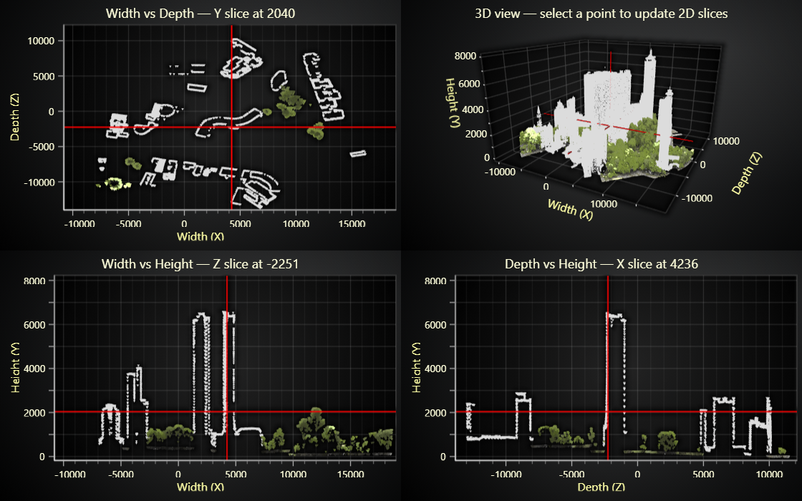

# JavaScript 3D Slicer 



This demo application belongs to the set of examples for LightningChart JS, data visualization library for JavaScript.

LightningChart JS is entirely GPU accelerated and performance optimized charting library for presenting massive amounts of data. It offers an easy way of creating sophisticated and interactive charts and adding them to your website or web application.

The demo can be used as an example or a seed project. Local execution requires the following steps:

-   Make sure that relevant version of [Node.js](https://nodejs.org/en/download/) is installed
-   Open the project folder in a terminal:

          npm install              # fetches dependencies
          npm start                # builds an application and starts the development server

-   The application is available at _http://localhost:8080_ in your browser, webpack-dev-server provides hot reload functionality.


## Description

Example of interactive 3D point-cloud slicing with linked 2D views. Click a point in the 3D Chart or drag slice lines in the 2D Charts to inspect the data from multiple perspectives.

The 3D crosshair is rendered using three *Line Series*, and the draggable slice markers in the 2D charts are created with `axis.addConstantLine()`. 

When the selection changes (either by clicking in 3D or dragging a 2D line), the slice series are refreshed by clearing the previous points and adding the newly computed slice. Slice line positions are synchronized using `constantLine.setValue()`.
```js
  // 2D Series
  seriesWH.clear()  
  seriesWH.appendJSON(sliceData)
  
  // 3D Series
  lineSeriesX.clear()
  lineSeriesX.add([{ x: minX, y: yPoint, z: zPoint }, { x: maxX, y: yPoint, z: zPoint }])

  // Constant line
  xAxisWHLine.setValue(value)
```

When using real-time or frequently updated charts, defining a maximum sample count is strongly recommended. 
Preallocating memory in this way is essential for stable performance and helps prevent rendering issues or crashes when large volumes of data are added.


LiDAR data source: [Philipp Urech](https://sketchfab.com/3d-models/parque-copan-ddfa8cf8aafa4d619e429d9e653ffe81) - Licensed under Creative Commons Attribute.

The same LiDAR data is also used in this example: [3D LiDAR Park Visualization](https://lightningchart.com/js-charts/interactive-examples/examples/lcjs-example-0910-3dLiDARPark.html).

## API Links

* [3D chart]
* [3D axis]
* [3D point cloud series]
* [3D line series]
* [XY chart]
* [Point series]
* [Constant lines]


## Support

If you notice an error in the example code, please open an issue on [GitHub][0] repository of the entire example.

Official [API documentation][1] can be found on [LightningChart][2] website.

If the docs and other materials do not solve your problem as well as implementation help is needed, ask on [StackOverflow][3] (tagged lightningchart).

If you think you found a bug in the LightningChart JavaScript library, please contact sales@lightningchart.com.

Direct developer email support can be purchased through a [Support Plan][4] or by contacting sales@lightningchart.com.

[0]: https://github.com/Arction/
[1]: https://lightningchart.com/lightningchart-js-api-documentation/
[2]: https://lightningchart.com
[3]: https://stackoverflow.com/questions/tagged/lightningchart
[4]: https://lightningchart.com/support-services/

© LightningChart Ltd 2009-2025. All rights reserved.


[3D chart]: https://lightningchart.com/js-charts/api-documentation/v8.1.0/classes/Chart3D.html
[3D axis]: https://lightningchart.com/js-charts/api-documentation/v8.1.0/classes/Axis3D.html
[3D point cloud series]: https://lightningchart.com/js-charts/api-documentation/v8.1.0/classes/PointCloudSeries3D.html
[3D line series]: https://lightningchart.com/js-charts/api-documentation/v8.1.0/classes/LineSeries3D.html
[XY chart]: https://lightningchart.com/js-charts/api-documentation/v8.1.0/classes/ChartXY.html
[Point series]: https://lightningchart.com/js-charts/api-documentation/v8.1.0/classes/PointLineAreaSeries.html
[Constant lines]: https://lightningchart.com/js-charts/api-documentation/v8.1.0/classes/ConstantLine.html

